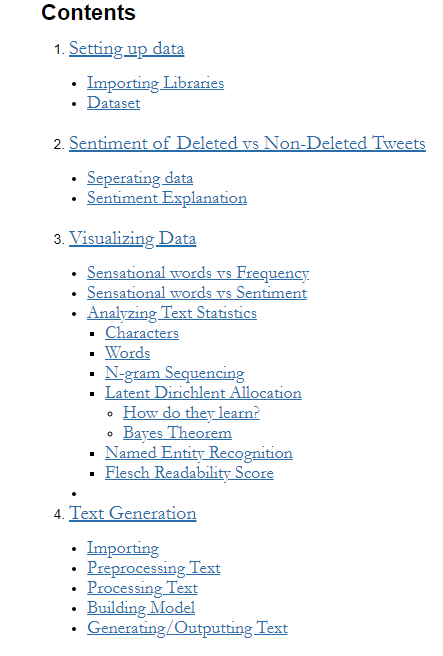

# TrumpBot

## Context 
The former US president Donald Trump was notoriously active on Twitter. On January 8th, 2021, the platform decided to suspend his account, citing "the risk of further incitement of violence" following the violent riots at the US Capitol building on Jan 6th. Trump's Twitter activity constitutes an important documentation of escalating polarisation in the US political and societal discourse during the second decade of the 2000s.

## Purpose
Following Trump's recent ban on Twitter, I thought it would be fun to build a trump-twitter-bot trained on a compilation of his past tweets. <a href='https://www.kaggle.com/datasets/headsortails/trump-twitter-archive'>Kaggle</a> provided a dataset storing 50,000+ tweets. 

Before building the bot, it is important to extract more meaning from the tweets. The jupyter notebook contains the following information:

</img>

The purpose of this project is for me to understand what I understand in data visualization and generation and what I do not. 

## What to Improve
<i>It is not always possible to be the best, but it is always possible to improve your own performance</i> - Jackie Stewart

I am going to continue tweeking the preprocess text, the actual model, and the output of the text. One thing I must include is some punctuation, which is an easy fix. Additionally, the model's generalization is a hit-or-miss, either the generated text is understandable, or not. 
